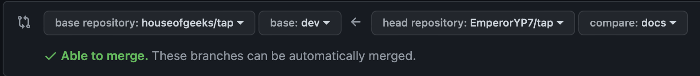

## Contributing Guide

- The tab indentation size is 4 (whitespaces) for this project.
- We use MERN stack for the project.
- The `/client` folder is the main directory for Create React App.
- The `/server` folder is the main directory for the express server (backend).


### Steps to land a successful PR

1. Fork the repository to your personal GitHub account. 
    We call this forked repo as `<YOUR_USERNAME>/tap` repo.

2. Now, clone `<YOUR_USERNAME>/tap` and add `houseofgeeks/tap` as the upstream:
    ```bash
    git clone https://github.com/<YOUR_USERNAME>/tap.git
    cd tap
    git remote add upstream https://github.com/houseofgeeks/tap.git
    git fetch upstream
    ```

3. Checkout to local's `dev` branch. And create a new branch with the name of your feature (eg. `docs`):
    ```bash
    git checkout dev
    git pull upstream dev
    git push origin dev
    git checkout -b <FEATURE_NAME>
    ```

4. Close the terminal and complete the task. You may commit your progress as many times as you like during the process:
    ```bash
    git add --all
    git commit -m "<YOUR_MESSAGE>"
    ```

5. Commit your progress if you haven't already and push it to `<YOUR_USERNAME>:<FEATURE_NAME>` likewise:
    ```bash
    git push origin <FEATURE_NAME>
    ```

6. Open your browser and go to `<YOUR_USERNAME>/tap` repo on GitHub.

7. Create a PR
**from `<YOUR_USERNAME>:<FEATURE_NAME>` to `houseofgeeks:dev`** (Very important step)
This should look something like this:

    

8. Wait for the maintainer to review your code.
If you need to make some changes, commit and push to `<YOUR_USERNAME>:<FEATURE_NAME>`.

9. Delete `<YOUR_USERNAME>:<FEATURE_NAME>` branch **after** the PR is merged or is out of scope.
    ```bash
    git checkout dev
    git push -d origin <FEATURE_NAME>
    git branch -d <FEATURE_NAME>
    ```

10. Repeat from step 3 for a new PR.

And you're done!

Please note we have a [Code of Conduct](Code_of_CONDUCT.md)
, please follow it in all your interactions with the project.
